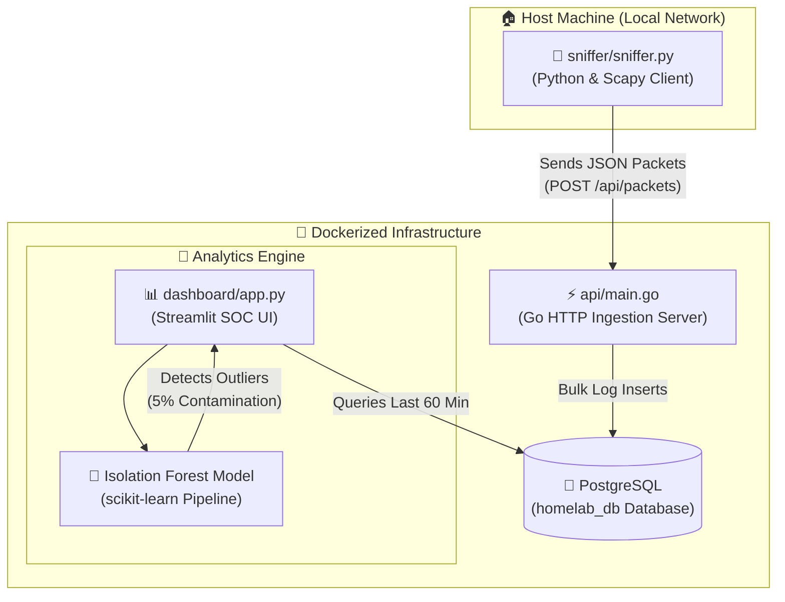

# 🛡️ Home Lab Threat Intelligence & Detection Dashboard

A real-time network security monitoring, ingestion, and machine learning-powered anomaly detection system designed to detect malicious activities, suspicious endpoints, and potential command & control (C2) communication in home laboratories.

---

## 📐 Architecture & Data Flow

This application is built using a decoupled, service-oriented architecture, splitting responsibilities between raw host-level capture, high-performance ingestion, structured storage, and streaming machine learning analytics.



---

## 🛠️ Technology Stack & Languages

| Service / Layer | Technology | Language | Purpose |
| :--- | :--- | :--- | :--- |
| **Packet Sniffer** | [Scapy](https://scapy.net/) | `Python 3.10` | Captures raw layer-3 packets from physical network adapters and forwards them asynchronously. |
| **Ingestion API** | [Go Standard Library](https://go.dev/) | `Go (Golang)` | Receives network streams concurrently with very low memory footprint and writes records into Postgres. |
| **Database** | [PostgreSQL 16](https://www.postgresql.org/) | `SQL` | Structured time-series store for network logs with custom `INET` column types for IP optimization. |
| **SOC Dashboard** | [Streamlit](https://streamlit.io/) | `Python 3.10` | Real-time monitoring and threat feeds, refreshing every 5 seconds. |
| **Machine Learning** | [scikit-learn](https://scikit-learn.org/) | `Python 3.10` | Unsupervised **Isolation Forest** outlier detection model. |
| **Orchestration** | [Docker Compose](https://www.docker.com/) | `YAML` | Multi-container microservice container configuration. |

---

## 📂 File System Layout

The codebase uses a clean, highly modular file system to isolate microservices and support future expansion:

```text
HOME-LAB-threat-detection/
├── .gitignore                   # Safe credentials & virtual environment filters
├── docker-compose.yml           # Multi-container service definitions
├── README.md                    # Core documentation & developer guide
│
├── api/                         # High-speed Ingestion Gateway
│   ├── Dockerfile               # Compiles binary into a minimal Linux container
│   ├── go.mod / go.sum          # Go dependency registries
│   └── main.go                  # Web server & DB connection layers
│
├── dashboard/                   # Machine Learning & Visualization Core
│   ├── Dockerfile               # Packages analytics runtime
│   ├── requirements.txt         # DS Stack (streamlit, pandas, scikit-learn)
│   ├── app.py                   # Streamlit live monitoring loop
│   └── analyzer.py              # Standalone command-line ML reporter
│
└── sniffer/                     # Local Packet Capture Utility
    ├── requirements.txt         # Sniffer stack (scapy, requests)
    └── sniffer.py               # Raw socket packet sniffer callback
```

---

## 🤖 How the Machine Learning Pipeline Works

The detection engine uses **unsupervised machine learning** (specifically an **Isolation Forest**) to spot anomalies. This approach does not require labeled malware datasets; instead, it looks for abnormal behaviors compared to normal baselines.

1. **Feature Engineering**: The pipeline aggregates network logs over a rolling **60-minute window**, grouping traffic by `destination_ip` and computing:
   - **Packet Count**: Frequency of communication.
   - **Average Packet Size**: Volume signature (small packets indicate heartbeats/pings; large indicates exfiltration).
   - **Total Bytes Transferred**: Total bandwidth footprint.
2. **Isolation Forest Model**:
   - Treats the engineered variables as multidimensional features.
   - Randomly partitions features. Since outliers are easier to isolate (they require fewer splits in decision trees), they get assigned lower path lengths in the trees.
3. **Anomalous Flagging**:
   - The model is configured with a `contamination=0.05` hyperparameter, which automatically flags the most extreme **5%** of traffic behaviors as anomalous (`-1`).
   - Flagged targets are immediately pushed onto the real-time SOC dashboard under the **🚨 Real-Time Threat Detection** report.

---

## 🚀 Getting Started

### 1. Start the Core Services (Dockerized)
Run the Postgres database, Ingestion API, and Streamlit Dashboard with a single command from the project root:

```bash
docker-compose up --build -d
```
- **Ingestion API** will listen on `http://localhost:8080`
- **Streamlit SOC Dashboard** will be available at `http://localhost:8501`
- **PostgreSQL Database** will run on port `5432`

---

### 2. Configure & Run the Sniffer (Host Level)
Since Scapy requires root/administrator privileges to bind to raw physical interfaces, it is run locally on the host machine.

#### Linux / macOS
```bash
# Set up a clean environment
cd sniffer
python3 -m venv venv
source venv/bin/activate
pip install -r requirements.txt

# Run sniffer with administrator privileges
sudo python3 sniffer.py
```

#### Windows (Run PowerShell as Administrator)
```powershell
cd sniffer
python -m venv venv
.\venv\Scripts\Activate.ps1
pip install -r requirements.txt

# Run the sniffer
python sniffer.py
```

Once running, your sniffer will print successful POST outputs:
`Successfully sent: 192.168.1.45 -> 104.244.42.1 | Size: 64 bytes`

---

## ⚙️ Customizing the Model Parameters
To customize behavior, you can modify configurations directly inside `dashboard/app.py`:
* **Rolling Window**: Change the PostgreSQL query interval (e.g., change `NOW() - INTERVAL '60 minutes'` to `24 hours` for longer baselines).
* **Contamination Rate**: Tweak `IsolationForest(contamination=0.05)` inside the main analysis loop. Setting it to `0.02` will only flag the top 2% of extreme behaviors, reducing false positives.
* **Polling Rate**: Change `time.sleep(5)` at the bottom of the script to adjust how often the Streamlit dashboard queries Postgres.
